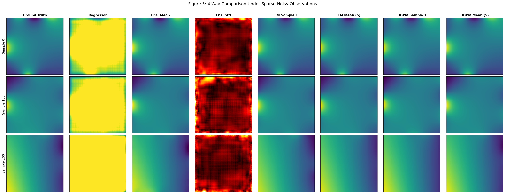
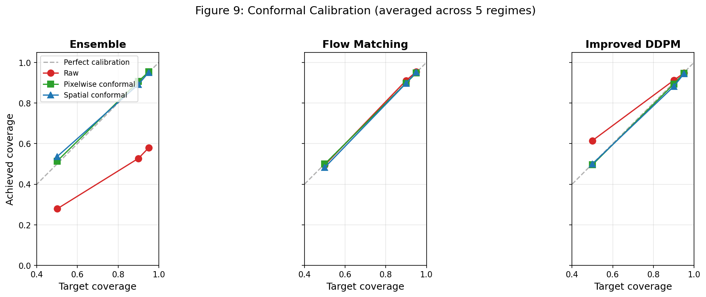

# Uncertainty Quantification for PDE Surrogates: Deep Ensembles, Flow Matching, Improved DDPM, Conformal Prediction, and Diffusion Posterior Sampling

## Overview

Neural surrogates can approximate PDE solutions orders of magnitude faster than traditional solvers. But when boundary conditions are uncertain — noisy sensors, sparse measurements — a point prediction isn't enough. You need calibrated uncertainty over the solution field. This project benchmarks how well different approaches capture that uncertainty and whether their confidence estimates can be trusted.

We compare six neural surrogates for 2D Laplace equation solution fields: a deterministic U-Net regressor, an FNO baseline, a deep ensemble (5 U-Nets), conditional flow matching (OT-CFM), an improved DDPM, and diffusion posterior sampling (DPS) with an unconditional prior — each wrapped with split conformal prediction for distribution-free coverage guarantees. The benchmark spans five observation regimes (exact, dense-noisy, sparse-clean, sparse-noisy, very-sparse) and a held-out boundary condition family (piecewise constant).

### Summary of Findings

- Under exact BCs, a Phase 2 DDPM 5-sample mean achieves 5x lower PDE residual than U-Net regression, but at 200x the inference cost — the FD solver remains faster and more accurate (caveat: DDPM was trained on mixed regimes, giving it an advantage on exact-BC test data)
- Under sparse noisy observations at matched K=5, generative models maintain 77-95% raw coverage while the ensemble collapses to 15-31%
- Conformal prediction lifts all methods to near-nominal 90% coverage, but DDPM produces intervals 1.2-6.6x tighter than the ensemble at matched sample count
- In this benchmark, the training improvements (Min-SNR + cosine schedule + v-prediction) were more impactful than the choice of generative framework — improved DDPM outperforms flow matching on functional CRPS despite FM's simpler training objective
- On held-out piecewise BCs, all models degrade but DDPM maintains the lowest calibration error (vs. ensemble) across all 5 observation regimes, suggesting but not proving that the generative prior captures transferable solution structure
- **New (v3):** Diffusion posterior sampling (DPS) with an unconditional prior reaches the observation noise floor in-distribution (obs RMSE within 5% of sigma) while paying a ~30x accuracy cost vs conditional DDPM. On zero-shot observation patterns, DPS is unaffected (PDE residual [4.26, 4.64]) while the conditional model collapses (PDE residual up to 934 on non-uniform sensors). See §10 of [Theoretical_Framework.pdf](Theoretical_Framework.pdf)

---

## Key Results

Three tables below; full 7-table breakdown in [docs/benchmark_results.md](docs/benchmark_results.md).

### Phase 1: Deterministic Accuracy and Physics Compliance (Exact BCs)

| Model | Rel. L2 (↓) | PDE Residual (↓) | BC Error (↓) | Max Principle Viol. | Energy Err (↓) |
|-------|-------------|------------------|-------------|--------------------|--------------------|
| FD solver (oracle) | 0 | ~1e-10 | 0 | 0% | 0 |
| U-Net regressor | 0.0114 | 20.58 | 0.0067 | 0% | 1.30% |
| FNO* | 0.4016 | 24.52 | 0.2088 | 0.6% | 4.48% |
| DDPM** (5-sample mean) | **0.0022** | **4.22** | **0.0014** | 0% | **0.21%** |

*FNO underperforms significantly (rel. L2 ~40x worse than U-Net), likely undertrained or undersized. Included as-is since the focus is on the ensemble/DDPM comparison.

**DDPM row uses the Phase 2 mixed-regime checkpoint evaluated on exact-BC test data — not a Phase 1 exact-regime model. This favors DDPM (trained on harder data, tested on easier data) relative to the U-Net/FNO baselines which were trained on exact BCs only. The comparison shows DDPM's field quality but is not a controlled Phase 1 comparison.

On OOD piecewise BCs, the same DDPM has the lowest PDE residual (4.68) but higher BC error (0.077) — the generative model captures interior physics well but struggles with unseen boundary families. Full OOD accuracy numbers in [benchmark_results.md](docs/benchmark_results.md).

### Phase 2: UQ Across Observation Regimes (In-Distribution, Pixelwise Conformal@90%)

| Regime | Ens raw@90 | FM raw@90 | DDPM raw@90 | Ens width | FM width | DDPM width | DDPM func. CRPS† |
|--------|-----------|----------|------------|----------|---------|-----------|-----------------|
| exact | 81.5% | 96.5% | 99.6% | 0.031 | 0.034 | **0.003** | — |
| dense-noisy | 54.6% | 87.7% | 87.8% | 0.072 | 0.070 | **0.044** | — |
| sparse-clean | 80.9% | 98.1% | 99.4% | 0.033 | 0.049 | **0.003** | — |
| sparse-noisy | 31.2% | 89.4% | 85.4% | 0.135 | 0.131 | **0.088** | **0.0077** |
| very-sparse | 15.4% | 83.8% | 83.7% | 0.376 | 0.331 | **0.248** | — |

†Center-T CRPS at matched 5v5 (sparse-noisy only). DDPM wins all 5 functionals; full CRPS table in [benchmark_results.md](docs/benchmark_results.md).

All coverage and interval width values use pixelwise (marginal) conformal prediction, not the spatial/simultaneous variant. Generative models use 20 samples for mean/std estimation; the ensemble uses 5 members. These are not matched-sample comparisons — see Table 4 / functional CRPS for a matched 5v5 evaluation.

After conformal calibration, all methods achieve near-nominal 90% coverage. But DDPM consistently produces the tightest intervals — 2-3x sharper than ensemble — indicating the best-calibrated raw uncertainty. Ensemble raw coverage degrades severely under noise (81% → 15%), while generative models maintain 84-97%.


*Ground truth, deterministic prediction, and generative samples with uncertainty maps for a sparse-noisy test case. DDPM produces sharper uncertainty concentrated at the boundaries where observations are missing.*

### OOD Generalization: Held-Out Piecewise BCs (All 5 Regimes)

| Regime | Ens cov@90 | FM cov@90 | DDPM cov@90 | Ens CRPS (↓) | DDPM CRPS (↓) | Ens cal err (↓) | DDPM cal err (↓) |
|--------|-----------|----------|------------|-------------|--------------|----------------|-----------------|
| exact | 65.2% | 80.1% | 86.0% | **0.013** | 0.014 | 0.171 | **0.055** |
| dense-noisy | 54.2% | 74.8% | 74.1% | **0.017** | 0.018 | 0.235 | **0.110** |
| sparse-clean | 61.8% | 85.1% | 87.0% | **0.015** | 0.021 | 0.188 | **0.047** |
| sparse-noisy | 39.0% | 76.9% | 77.0% | **0.026** | 0.028 | 0.315 | **0.084** |
| very-sparse | 16.4% | 76.2% | 73.7% | 0.068 | **0.066** | 0.425 | **0.122** |

The generalization gap **widens under observation uncertainty**: ensemble coverage drops from 65% to 16% across regimes, while generative models hold 74-87%. Ensemble CRPS is lowest on 4 of 5 regimes because its predictions are accurate on average, but its uncertainty is too narrow — producing tight intervals that frequently miss the ground truth. DDPM's slightly higher CRPS reflects wider intervals that actually contain the truth. At very-sparse, where the observation gap is largest, DDPM overtakes ensemble on CRPS as well.

Note: FM calibration error is not reported in this table; the claim that DDPM has the lowest calibration error is relative to the ensemble only.


*Raw coverage (dashed) vs conformalized coverage (solid) at 50/90/95% targets, averaged across regimes. Conformal prediction lifts all methods to the diagonal, but the raw gap shows how much correction each method needs — DDPM starts closest to nominal.*

---

## Methods

**Deep Ensemble (5 U-Net regressors).** Five independently trained regressors with random initialization and data shuffling. Predictive uncertainty is the pixelwise variance across members. This is the fairness bar: a probabilistic non-generative baseline that captures epistemic uncertainty from seed diversity alone. If DDPM wins on calibration, the interpretation is "DDPM captures richer posterior structure than seed-diversity alone," not "DDPM captures the true posterior."

**Conditional Flow Matching (OT-CFM).** Learns a velocity field transporting Gaussian noise to solution fields, conditioned on boundary observations. Uses mini-batch optimal transport (Hungarian algorithm) coupling for straighter learned flows — the OT coupling minimizes transport cost, analogous to the Benamou-Brenier formulation in optimal transport theory. Sampling is a 50-step Euler ODE solve. Despite simpler training dynamics (no noise schedule), FM underperforms DDPM on most metrics in this benchmark, suggesting the training improvements mattered more than the generative framework in this setup.

**Improved DDPM.** Standard DDPM trained for 60 epochs achieved only 16.8% raw coverage due to undertraining — the loss was still decreasing but the model hadn't learned the full noise-level spectrum. Three targeted fixes solved this: cosine noise schedule (better noise distribution for 64x64 data), v-prediction parameterization (numerically stable across all noise levels), and Min-SNR-gamma weighting (3.4x convergence speedup by rebalancing the loss across timesteps). These compound to give 85-99% raw coverage at the same 80-epoch training budget.

**Diffusion Posterior Sampling (DPS).** Uses an unconditional DDPM prior trained on clean Laplace solutions (no boundary conditioning) combined with gradient guidance at inference time to incorporate observations. The key advantage: a single unconditional model handles any observation pattern without retraining — if the sensor layout changes, only the forward operator in the guidance term changes. On in-distribution regimes, DPS pays a ~30x accuracy cost vs conditional DDPM but reaches the observation noise floor (obs RMSE within 5% of sigma_obs). On zero-shot observation patterns (non-uniform sensors, single-edge observation, extreme noise), DPS is unaffected (PDE residual [4.26, 4.64]) while the conditional model collapses (PDE residual up to 934). See [DECISIONS.md](DECISIONS.md) for guidance tuning analysis.

**Conformal Prediction.** A post-hoc calibration wrapper that uses held-out calibration data to compute a nonconformity quantile scaling prediction intervals for finite-sample coverage guarantees. Both spatial (simultaneous coverage over the full field) and pixelwise (marginal per-pixel) variants are implemented. The key result: conformal calibration makes all methods achieve near-nominal coverage, but cannot fix the underlying sharpness — the raw uncertainty quality determines interval width.

**Architecture.** The regressor, DDPM, and flow matching all share the same ConditionalUNet backbone (~5M parameters). The only difference is the training objective (MSE, noise/v-prediction, velocity prediction) and the sampling procedure (single forward pass, 200-step SDE, 50-step ODE). This isolates the contribution of the generative framework from the architecture.

**Conditioning.** Boundary conditions are encoded as 8 channels (4 value channels + 4 observation mask channels) broadcast along perpendicular axes. This preserves edge identity without assuming interpolation — the model learns to discount the broadcast structure in the interior. Phase 2 models are trained from scratch on noisy/sparse BCs; no Phase 1 weights are reused.

---

## Honest Scope

**The PDE is deliberately simple.** The 2D Laplace equation on a unit square has a fast, exact finite-difference solver (~0.5ms per solve). Neural surrogates do not beat the solver on accuracy or speed. The value proposition is amortized posterior inference under observation uncertainty, not replacing the solver.

**All posterior evaluations are with respect to a synthetic prior.** The uncertainty reflects what is unknown given noisy/sparse boundary observations under the specific prior over boundary profiles defined by the dataset generator and the observation-noise model. This is not a general-purpose physics uncertainty estimate. The "noisy observations" setup is synthetic — a controlled study of posterior inference, not a claim about deployment.

**Sample count fairness.** Functional-level CRPS (5 derived quantities) uses matched sample counts: 5 ensemble members vs 5 generated fields. This is the primary comparison. Pixel-level UQ metrics use 20 samples for generative model mean/std estimation, giving them a statistical advantage over the ensemble's 5 members. A matched pixel-level comparison at 5 samples, and a secondary comparison at 10 DDPM samples, are pending.

**The held-out BC family test is one specific OOD stress test.** Piecewise constant BCs are excluded from training entirely. A lower OOD/in-dist ratio suggests stronger generalization but does not prove a model has learned the PDE in any deep sense.

**FNO is undertrained.** The FNO baseline (rel. L2 ~0.40) is likely undersized for this problem. It was not tuned further since the project focus is the ensemble/DDPM comparison. FNO was not retrained for Phase 2.

**Single-run results.** All numbers are from single trained checkpoints with fixed random seeds. No cross-seed variance is reported. Rankings could shift with different initializations.

**The physics-regularization experiment (physics-regularized DDPM) is not yet trained.** Code and config exist (`src/diffphys/model/physics_ddpm.py`) but no experimental results are available.

---

## Project Structure

```
src/diffphys/
  model/         - U-Net, DDPM, Flow Matching, Ensemble, FNO, DPS, Unconditional DDPM
  evaluation/    - UQ metrics, conformal prediction, functionals
  data/          - Dataset, observation regimes
  pde/           - Laplace solver, boundary condition generation
configs/         - YAML configs for all models
scripts/         - Training, evaluation, plotting
modal_deploy/    - Remote GPU training/evaluation on Modal (incl. DPS experiments)
experiments/     - Checkpoints and results
figures/         - Generated plots
tests/           - 224 unit tests across 21 test files
docs/            - Technical documentation and theory
```

## Reproducing Results

### Training

```bash
# Train flow matching and DDPM on Modal (remote GPU)
modal run modal_deploy/train_remote.py --config configs/flow_matching.yaml --config2 configs/ddpm_improved.yaml

# Train ensemble
modal run modal_deploy/train_remote.py --config configs/ensemble.yaml

# Or train locally
python scripts/train.py --config configs/flow_matching.yaml
```

### Evaluation

```bash
# Full Phase 2 UQ evaluation (all models, all regimes)
modal run modal_deploy/evaluate_remote.py --eval-type phase2-all

# Conformal prediction calibration and evaluation
modal run modal_deploy/evaluate_remote.py --eval-type conformal

# OOD evaluation on held-out piecewise BCs (all regimes)
modal run modal_deploy/evaluate_remote.py --eval-type ood-regimes

# Functional CRPS (5 derived quantities, matched 5 samples)
modal run modal_deploy/evaluate_remote.py --eval-type functional-crps

# DDPM accuracy on Phase 1 exact BCs
modal run modal_deploy/evaluate_remote.py --eval-type ddpm-phase1

# DPS: train unconditional prior, run guidance tuning, evaluate zero-shot
modal run modal_deploy/train_remote.py --config configs/unconditional_ddpm.yaml
modal run modal_deploy/dps_preflight.py
modal run modal_deploy/dps_experiments.py
modal run modal_deploy/dps_zero_shot.py
```

Training runs on Modal T4 GPUs with checkpoints saved every 20 epochs to a persistent volume. Evaluation uses 300 samples for in-distribution tests (from 5,000 available) and 150 for OOD (from 1,000 held-out piecewise BCs). See [computational cost breakdown](docs/benchmark_results.md#table-8-computational-cost) for per-model training times.

## References

1. Ho, J., Jain, A., & Abbeel, P. (2020). Denoising Diffusion Probabilistic Models. *NeurIPS*.
2. Lipman, Y. et al. (2023). Flow Matching for Generative Modeling. *ICLR*.
3. Tong, A. et al. (2024). Improving and Generalizing Flow-Based Generative Models with Minibatch Optimal Transport. *TMLR*.
4. Lakshminarayanan, B., Pritzel, A., & Blundell, C. (2017). Simple and Scalable Predictive Uncertainty Estimation using Deep Ensembles. *NeurIPS*.
5. Vovk, V., Gammerman, A., & Shafer, G. (2005). *Algorithmic Learning in a Random World*. Springer.
6. Nichol, A. & Dhariwal, P. (2021). Improved Denoising Diffusion Probabilistic Models. *ICML*.
7. Salimans, T. & Ho, J. (2022). Progressive Distillation for Fast Sampling of Diffusion Models. *ICLR*.
8. Hang, T. et al. (2023). Efficient Diffusion Training via Min-SNR Weighting Strategy. *ICCV*.
9. Chung, H. et al. (2023). Diffusion Posterior Sampling for General Noisy Inverse Problems. *ICLR*.
10. Huang, J. et al. (2024). DiffusionPDE: Generative PDE-Solving Under Partial Observation. *NeurIPS*.
